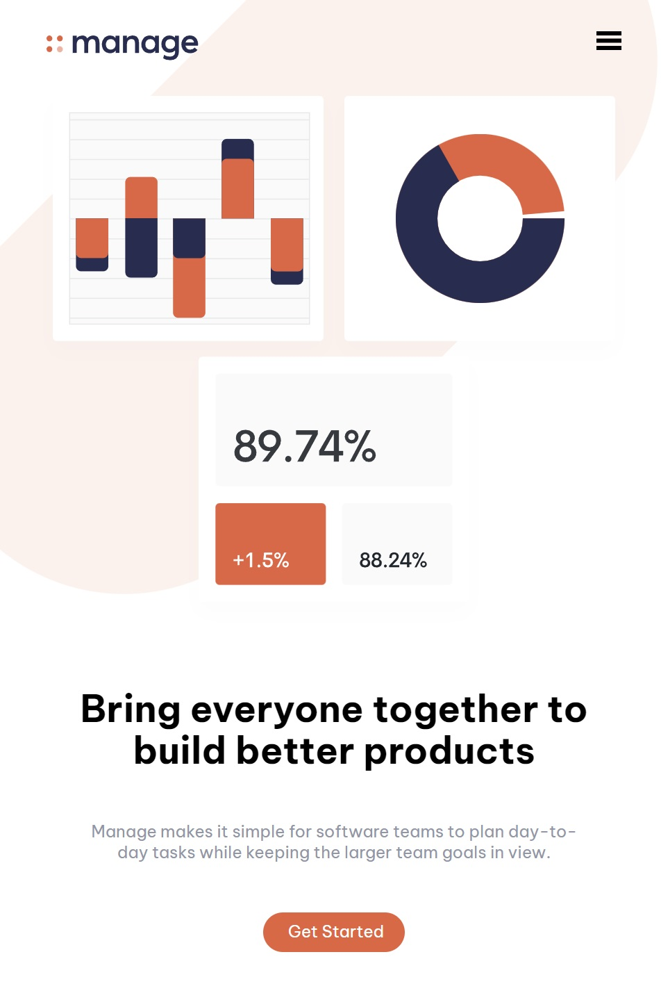
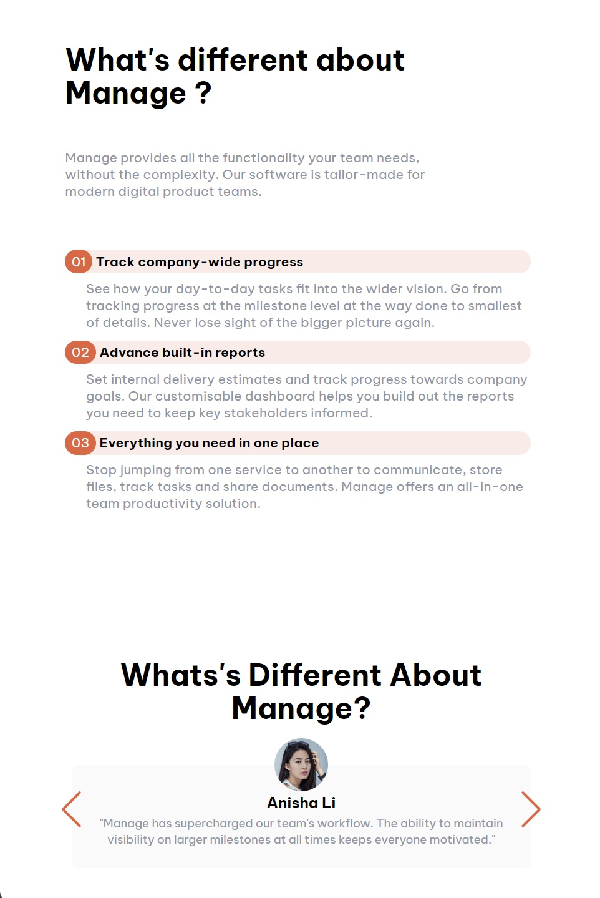
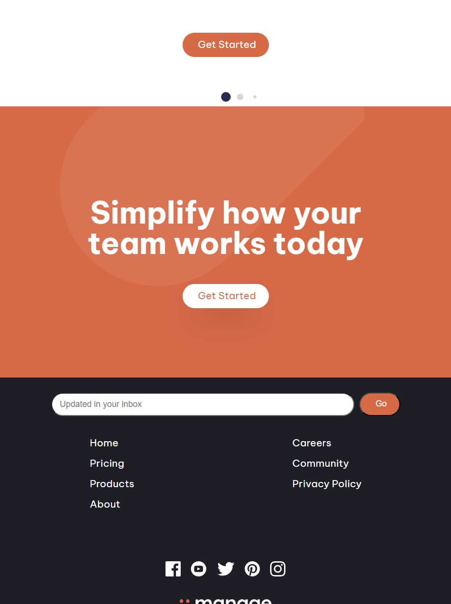

# Frontend Mentor - Manage landing page solution

## Overview

### The challenge

This is my version of Fronend Mentor - Manage Landing Page solution
I started out by folowing a tutorial using Tailwind CSS to create the landing page.

After that I did a second version, using plain HTML, CSS and a some Javascript. This is the version that I include in this repo.

While writing the HTML, CSS I used the BEM methology for CSS design
For the testimonial slider, I used SwiperJS

### Screenshots:

## Mobile Top

## Mobile Mid

## Mobile Bottom

### Links

- Solution URL: [Add solution URL here](https://your-solution-url.com)
- Live Site URL: [Add live site URL here](https://your-live-site-url.com)
